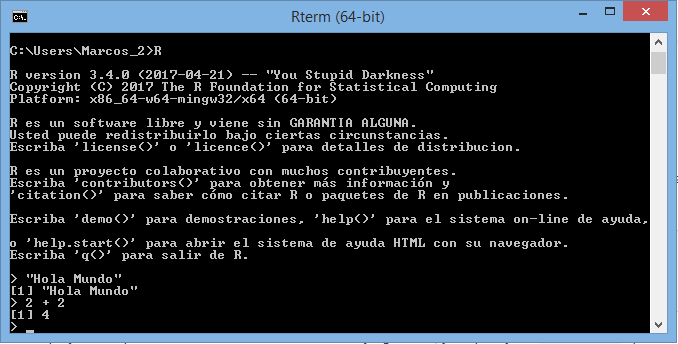
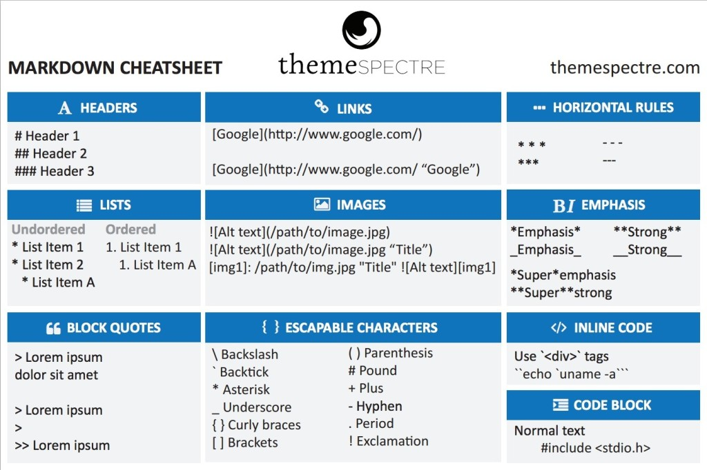
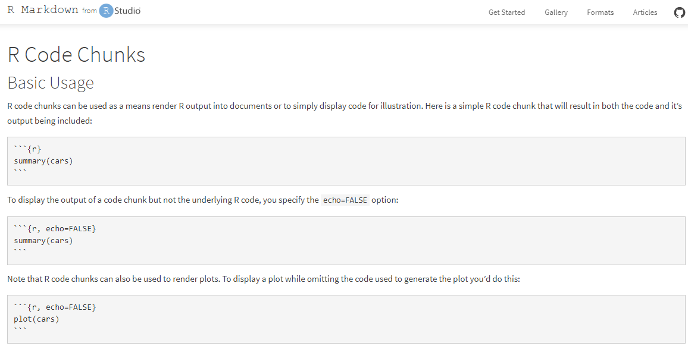

```{r setup, include=FALSE}
knitr::opts_chunk$set(echo = FALSE)
```

## Agenda

* R y R Studio
* Productos de datos con R y R Studio
* GitHub y Markdown
* Taller: Intalación y configuración
* Taller: Hola mundo

## Historia de R


## [R Project](https://www.r-project.org/)




## [R Studio](https://www.rstudio.com/)


## Productos de datos con R y R Studio

Productos | Librerías
--- | ---
Tablas | xlsx, excel.link
Informes/Infografías | R Markdown, R Presentations, R Slidy, R Notebook
Reporte dinámico/Dashboard | R Shiny
Gráficos dinámicos | ggplot2, plotly, Highcharter, rCharts, etc

# Ventajas de hacerlo con R

# Agilidad en el desarrollo

R abstrae una capa importante de desarrollo. 
Para construir cualquier producto nosotros deberiamos saber por lo menos: HTML, css, web services, JavaScript, etc.

# Integración directa con la herramienta estadística

Adios al control C + V típico cuando se generaban informes de resultados estadísticos.

## Ejemplo

```{r cars, echo = TRUE}
summary(cars)
```

## Ejemplo

```{r echo=FALSE, message=FALSE, warning=FALSE}
library(highcharter)
library("quantmod")

x <- getSymbols("GOOG", auto.assign = FALSE)

hchart(x)
```


## GitHub y Markdown
<br><br>


## Markdown 


## R Markdown


# Talleres

## Instalar R y RStudio

* [Descargar R](https://cran.r-project.org/bin/windows/base/)
* [Descargar R Studio](https://www.rstudio.com/products/rstudio/download/)
* Instalaciones por defecto

## Instalar librerías

* install.packages("rmarkdown")
* install.packages("shiny")
* install.packages("highcharter")
* install.packages("plotly")
