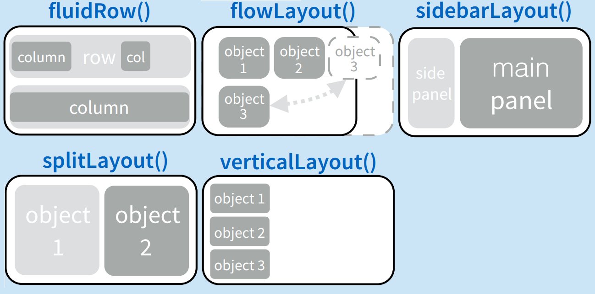
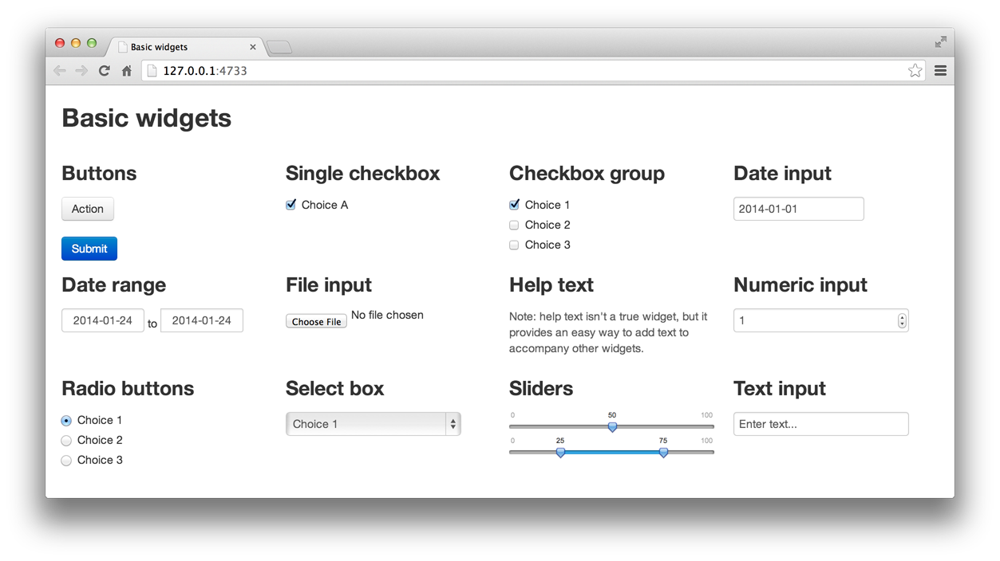

```{r setup, include=FALSE}
knitr::opts_chunk$set(echo = TRUE)
```

## Introducción

El paquete Shiny es una contribucion gratuita a R, provee una forma fácil y rapida de desarrollo de productos de datos a travez de navegadores web modernos. Shiny viene con una variedad de widgets para la construcción rapida de interfaces de usuario web, nosotros escribimos el codigo en R y shiny hará el trabajo pesado de generar el HTML, css, javascript, jquery, etc.

Bibliografía:

Web application development with R using Shiny, Chris Beeley, 2013, Packt Publishing Ltd.

[Developing Data Products in R, Brian Caffo and Sean Kross](https://leanpub.com/ddp/read_full)


## Crear un proyecto Shiny desde R Studio

Para crear un nuevo proyecto shiny desde R Studio existen varias formas, se puede utilizar un R Script en blanco o utilizar el asistente.

## Estructura de una App Shiny

Para crear una App Shiny basta con tener 2 funciones: ui y server, en la parte UI vamos a dibujar la interfaz de usuario colocando todos los componentes que queremos mostrar, y en la parte del server vamos a colocar la lógica de programación. 

En R Studio: creamos un script en blanco, lo guardamos como "app.R" y pegamos el siguiente código.


```

library(shiny)

# Ejemplo clásico en shiny

# en UI declaramos la interface de usuario
ui <- fluidPage(
   
   # ingresamos un titulo
   titlePanel("Old Faithful Geyser Data"),
   
   # sidebar es una seccion de la página web que estara a la izquierda de la pantalla
   # aquí ponemos un control para el numero de agrupaciones de un histograma
   
   sidebarLayout(
      sidebarPanel(
         sliderInput("bins",
                     "Number of bins:",
                     min = 1,
                     max = 50,
                     value = 30)
      ),
      
      # mainpanel es la seccion  principal que estará al centro de la pantalla
      # aqui pondremos los graficos o productos de datos principales de nuestra visualización
      
      mainPanel(
         plotOutput("distPlot")
      )
   )
)

# La parte del server contiene la lógica de la programación, 
# aquí pondremos que se va a graficar y si es necesario una transformación de datos
# tiene que estar aquí

# recibe dos parámetros
# input: todos los componenetes de entrada, ejemplo: una lista de selección
# output: todos los componentes de salida donde vamos a escribir o graficar
server <- function(input, output) {
    
    # la variable output contendra todas las variables que definimos en el UI
    # en este caso vamos a dibujar un histograma
    
   output$distPlot <- renderPlot({
      # generate bins based on input$bins from ui.R
      x    <- faithful[, 2] 
      bins <- seq(min(x), max(x), length.out = input$bins + 1)
      
      # draw the histogram with the specified number of bins
      hist(x, breaks = bins, col = 'darkgray', border = 'white')
   })
}

# Escencial para cuando utilizamos un solo archivo.
shinyApp(ui = ui, server = server)

```

Para una app pequeña el modelo anterior funciona muy bien, pero ahora que pasa si la complejidad de la aplicacion crece y nos deja como resultado un archivo gigante con muchas líneas de código, por esta razón vamos a dividir el archivo anterior en 2: ui.R y server.R y vamos a copiar cada pedazo de código de la siguiente forma:

### ui.R

``` 

library(shiny)

# Ejemplo clásico en shiny

# en UI declaramos la interface de usuario
ui <- fluidPage(
   
   # ingresamos un titulo
   titlePanel("Old Faithful Geyser Data"),
   
   # sidebar es una seccion de la página web que estara a la izquierda de la pantalla
   # aquí ponemos un control para el numero de agrupaciones de un histograma
   
   sidebarLayout(
      sidebarPanel(
         sliderInput("bins",
                     "Number of bins:",
                     min = 1,
                     max = 50,
                     value = 30)
      ),
      
      # mainpanel es la seccion  principal que estará al centro de la pantalla
      # aqui pondremos los graficos o productos de datos principales de nuestra visualización
      
      mainPanel(
         plotOutput("distPlot")
      )
   )
)
  
``` 

### server.R

```

library(shiny)

# La parte del server contiene la lógica de la programación, 
# aquí pondremos que se va a graficar y si es necesario una transformación de datos
# tiene que estar aquí

# recibe dos parámetros
# input: todos los componenetes de entrada, ejemplo: una lista de selección
# output: todos los componentes de salida donde vamos a escribir o graficar
server <- function(input, output) {
    
    # la variable output contendra todas las variables que definimos en el UI
    # en este caso vamos a dibujar un histograma
    
   output$distPlot <- renderPlot({
      # generate bins based on input$bins from ui.R
      x    <- faithful[, 2] 
      bins <- seq(min(x), max(x), length.out = input$bins + 1)
      
      # draw the histogram with the specified number of bins
      hist(x, breaks = bins, col = 'darkgray', border = 'white')
   })
}
```
Nos aseguramos que los dos archivos esten en la misma carpeta, y para ejecutar vamos a la consola y ponemos el siguiente código

```
runApp("c:/directorio/aplicacion")
```
Otra opción para ejecutar es ir a ui.R y dar click en el botón -> Run

Para una mejor organización recomiendo usar el asistente para crear proyectos, y dentro del proyecto crear una carpeta por aplicación, de esta forma tenemos todos las aplicaciones identificadas y nos va a ser más fácil linkearlos.

# Interfaces de usuraio UI

Shiny por defecto trae varios esquemas de presentacion (layouts), estos esquemas nos permiten tener dividida la pantalla en secciones y lo único que debemos hacer es ir rellenandolas con nuestros objetos

## Tags HTML

Para cuando necesitamos un estilo más personalizado podemos mezclar un poco del clásico HTML usando los tags que provee shiny, creamos un ui.R con el siguiente código:

```

library(shiny)
fluidPage(
  tags$div(
    h1("Hello Shiny!"),
    hr(),
    p(strong("bold font "), em("italic font")),
    p(code("code block")),
    a(href="http://www.google.com", "link to Google"),
    HTML('<p>
         <label>A numeric input:</label><br /> 
         <input type="number" name="n" value="7" min="1" max="30" />
         </p>')
    )
  )
  
```

## Paneles

Los paneles sirven para agrupar elementos, internamente shiny los transformara en un <div> del HTML resultante, los paneles disponibles son: 

```

absolutePanel()
conditionalPanel()
fixedPanel()
headerPanel()
inputPanel()
mainPanel()
navlistPanel()
sidebarPanel()
tabPanel()
tabsetPanel()
titlePanel()
wellPanel()

```

## Layouts

Los layouts se utilizan para organizar los paneles y elementos dentro de un layout existente.

<div style="text-align: center">
  
</div>

Ejemplo:

```
library(shiny)
fluidPage(
  titlePanel("Hello Shiny!"),
  sidebarLayout(
    sidebarPanel(HTML('<p>
         <label>A numeric input:</label><br /> 
         <input type="number" name="n" value="7" min="1" max="30" />
         </p>')),
    mainPanel(
      p(strong("bold font "), em("italic font")),
      p(code("code block")),
      a(href="http://www.google.com", "link to Google"))
  )
)
```

## Input widget

Los widgets son controles con los que el usuario va a interactuar, es decir que mediante estos controles el usuario va a comunicarse con nuestra aplicacion, filtrar, seleccionar, ingresar un dato por parámetro.

function | widget
--- | ---
actionButton | Botón para acciones
checkboxGroupInput | Un grupo de checkboxes
checkboxInput | Un simple checkbox
dateInput | Seleccion de una fecha
dateRangeInput | Seleccion de un par de fechas 
fileInput | Subir un archivo
helpText | Texto de ayuda para otro control
numericInput | Campo para insertar un dato numérico
radioButtons | Un grupo de radio buttons
selectInput | Clasica caja con opciones para seleccionar
sliderInput | Control para seleccionar un dato numérico 
submitButton | Un boton de submit
textInput | Campo para ingresar un dato de texto


<div style="text-align: center">
  
</div>


## Ejercicio: Armemos nuestro primer layout

```

library(shiny)
fluidPage(
  #título
  titlePanel("Mi primera Shiny App"),
  sidebarLayout(
    sidebarPanel(
      numericInput("numInput", "Ingresa un número:", value = 7, min = 1, max = 30)
    ),
    mainPanel(
      p(strong("bold font "), em("italic font")),
      p(code("code block")),
      a(href="http://rusersgroup.com/", "R User Group"))
  )
)

```


# El lado oscuro (server.R) 

Ya que temos listo nuestro UI, vamos a enlazarlo con el server.

## Output

Para graficar cualquier elemento debemos entender que hace la parte del output, el output trabaja tanto con el UI como con el server mediante las funciones render() y output()

<div style="text-align: center">
  
</div>

Como vemos en la imagen anterior cada elemento que queremos graficar tiene una función que colocaremos en el UI y otra en el Server.

### Listado de outputs

Output | function	render | function	creates
--- | --- | ---
htmlOutput/uiOutput | renderUI | Salida para HTML
imageOutput | renderImage | Imagenes
plotOutput | renderPlot | gráficos
tableOutput | renderTable | Para imprimir una tabla (data frame, matrix, etc)
textOutput | renderText | salidas de texto
verbatimTextOutput | renderPrint | imprimir texto (ej: summary(cars))


## Ejercicio: Armando una app con server side.

### ui.R

```
library(shiny)
fluidPage(
  titlePanel("Hello Shiny!"),
  sidebarLayout(
    sidebarPanel(
      numericInput("numInput", "A numeric input:", value = 7, min = 1, max = 30)
    ),
    mainPanel(
      textOutput("txtOutput")
    )
  )
)

```

### server.R

```

library(shiny)
function(input, output) {
  output$txtOutput = renderText({
    paste0("The area of the circle is: ", pi*input$numInput^2)
  })
}

```

## Ejercicio App leyendo un csv
