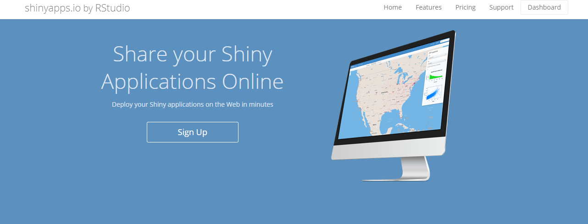
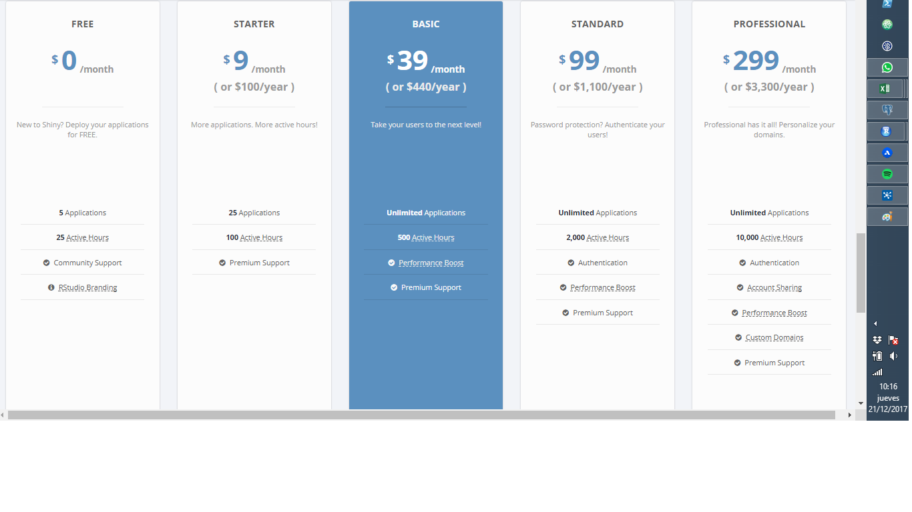
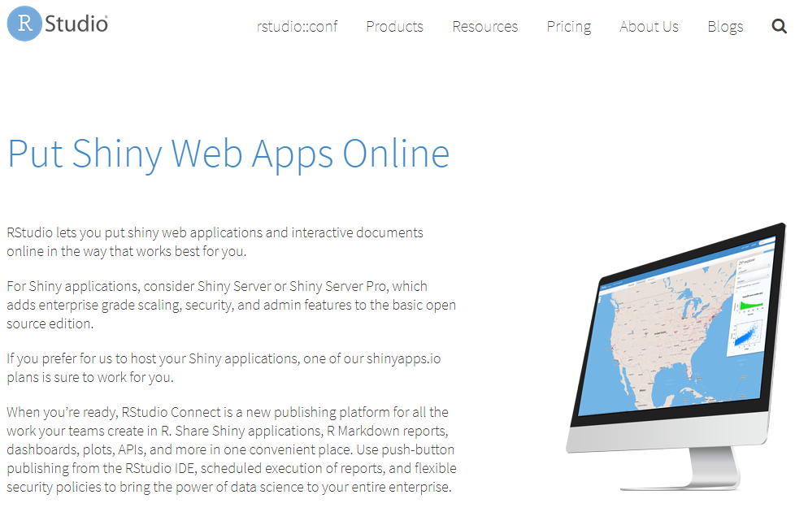

Publicando nuestras obras
========================================================
author: Marcos Armas
date: 21-diciembre-2017
autosize: true

Introduccion
===

Cuando hablamos de publicar apps de shiny vamos a conocer 2 palabras nuevas:

- En la nube: un servidor de terceros, tambien conocido como SaS
- On premisse: servidor propio

En la nube - shinyapps.io
===



Es una aplicacion del estilo *nube* o *SaS*, lo que quiere decir que es un servicio de costo mensual a la medida, segun tus requerimientos puedes incrementar o disminuir los recuros (cpu, ram, disco) contratados. 

How much?
===



On Premisse - Shiny Server
===



How much?
===

Shiny server tiene varias categorias, muchas de ellas se solicita ponerse en contacto con un representante, pero el costeo al fin termina por los siguientes niveles:

1. Seguridades
2. Numero de usuarios
3. Soporte tecnico
4. etc..

https://www.rstudio.com/pricing/

El sofware libre es gratis?
===

Hay muchos debates sobre este tema, pero el software libre no siempre es gratis, la ventaja es que puedes utilizar una parte gratis y ver su codigo fuente.

Sin embargo esa parte gratis muchas veces no se lo puede *profesionalizar* es decir, ponerlo en un marco de trabajo profesional, con procesos, roles y productos.

RStudio es ese acercamiento a la profesionalizacion de R.

Consideraciones antes de publicar una APP
========================================================

1. Tamano de la data
2. Tildes y encodings
3. Rendimiento
4. Conexiones de bases de datos
5. Librerias


Tamano de la data
===

ENV_2016.csv: tiene un peso de ~92MB

Usar RData comprime la data y es mas rapido para cargarlo.

```
# Grabar
nacidos <- read.csv("./ENV_2016.csv")
save(nacidos, file="nacidos_vivos2016.RData")

# Leer
load("./nacidos_vivos2016.RData")
```

Cuanto pesa Ahora?

Tildes y encodings
===

Las tildes y caracteres especiales pueden llegar a ser un dolor de cabeza en R, hay que tener en cuenta que los ambientes Linux se comportan diferente a Windows en este aspecto.

- Encoding(nacidosVivos$prov_nac) <- "latin1"
- enc2utf8(nacidosVivos$prov_nac)
- enc2native(nacidosVivos$prov_nac)
- iconv(nacidosVivos$prov_nac, to="UTF-8")

Rendimiento
===

Si nuestra app llama a algun algoritmo complejo, es crucial que este no demore mucho, optimizar el codigo de forma tal que el usuario no deba esperar mas de 25 segundos en esperar que cargue la pantalla

- Usar data table en vez de data.frame
- Data en RData
- Paralelizar?
- GPU processing

Conexiones a la base de datos
===

Si trabajamos con una base de datos debemos asegurarnos que el servidor tenga acceso a la misma.

Si vamos a publicar a shinyapps la base de datos debe tener una ip publica

Librerias
===

Asegurarse que todas las librerias necesarias esten instaladas en el servidor.

Se recomienda crear un script que instale todas las librerias necesarias para no pasar apuros.


Publicando en Shiny Apps
===

1. Creamos una cuenta en https://www.shinyapps.io/
2. Enlazamos RStudio con shiny apps
3. Publicamos 

Instalando Shiny Server desde Docker
===

Shiny server esta disponible solo para ambientes linux.

Para no sentirnos descolados usarmos Docker, que es una plataforma de contenerizacion (diferente a una VM).

Esta dispobible para windows 8 en adelante.

