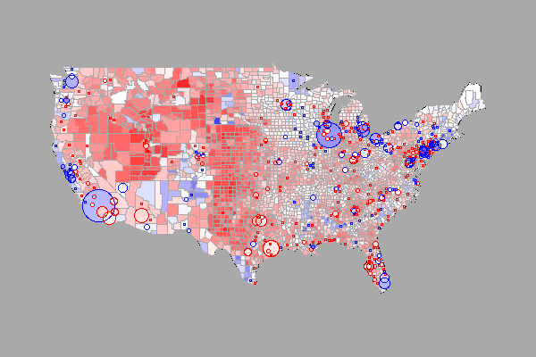

Ejemplo_presentacion_1
========================================================
author: Marcos Armas
date: 12-12-2017
autosize: true
transition: zoom
transition-speed: fast
navigation: section

Introducción
========================================================
type: section

Ejemplo con código en R
========================================================


```r
summary(cars)
```

```
     speed           dist       
 Min.   : 4.0   Min.   :  2.00  
 1st Qu.:12.0   1st Qu.: 26.00  
 Median :15.0   Median : 36.00  
 Mean   :15.4   Mean   : 42.98  
 3rd Qu.:19.0   3rd Qu.: 56.00  
 Max.   :25.0   Max.   :120.00  
```
Numeración
========================================================

1. A
1. B
1. C

Lista
========================================================

- item 1
- item 2
- item 3

Gráfico
========================================================



Slide With Plot
========================================================


